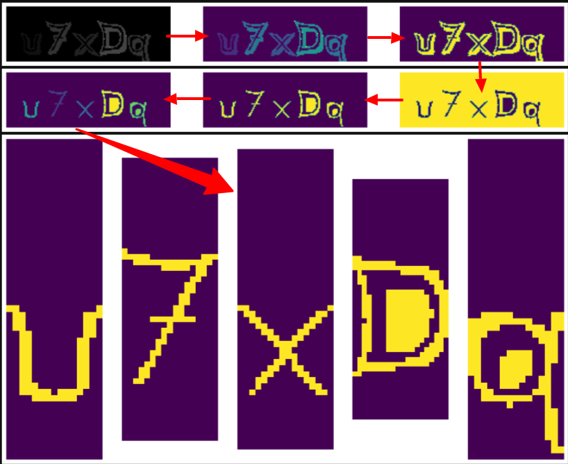

# CoWIN CAPTCHA Solver (POC)
#### Mostly Harmless


An elementary CAPTCHA solver for CoWIN App

## How to run this

```sh
git clone git@github.com:janghaludu/cowin-captcha.git
cd cowin-captcha
#Create and activate your virtual environment
pip install pip==19.3.1
pip install chalice==1.23.0
# These are not added in requirements.txt to minimize the deployment size for AWS deployment
pip install -r requirements.txt
chalice local
```

This will start a local server running on port 8000

### How to use it

Make a POST request to http://127.0.0.1 with {"captcha" : svgText} in body and get the text for captcha in response's text. 
```
svgText = <svg xmlns="http://www.w3.org/2000/svg" width="150" height="50" viewBox="0,0,150,50"><path fill="#222" d="M22.66 30.42L22.65 30.41L22.65 30.41Q19.24 36.82 15.81 40.78L15.81 40.78L15.83 40.80Q13.98 41.23 11.55 42.11L11.56 42.12L11.44 42.00Q16.40 36.45 21.16 28.04L21.14 28.02L21.10 27.98Q16.52 21.04 10.54 14.65L10.50 14.60L10.59 14.69Q13.56 15.95 15.85 16.45L15.73 16.33L15.83 16.43Q20.47 21.64 22.91 25.60L22.87 25.56L22.77 25.46Q25.44 21.21 29.36 16.79L29.23 16.66L29.25 16.68Q30.79 16.32 33.99 15.56L34.09 15.65L34.12 15.68Q28.01 22.10 24.54 28.04L24.49 27.99L24.51 28.00Q29.66 36.65 34.03 41.22L34.09 41.27L34.11 41.29Q31.48 40.46 29.39 40.23L29.40 40.24L29.34 40.18Q26.64 37.29 22.72 30.48ZM29.39 40.65L29.39 40.65L29.29 40.55Q29.61 40.61 30.07 40.72L30.16 40.81L30.10 40.75Q30.90 41.51 32.42 43.11L32.44 43.13L32.42 43.11Q35.66 43.80 38.70 45.17L38.85 45.31L38.77 45.24Q31.58 38.58 26.48 29.82L26.55 29.89L26.59 29.93Q30.38 23.33 36.28 16.48L36.15 16.35L36.16 16.35Q34.82 17.11 32.65 17.64L32.54 17.53L32.56 17.55Q33.49 16.70 35.25 14.91L35.30 14.96L35.27 14.93Q32.86 15.80 29.17 16.37L29.13 16.33L29.05 16.25Q25.71 20.14 23.12 24.44L23.11 24.43L23.18 24.50Q22.13 22.76 20.95 21.28L20.91 21.25L18.66 18.35L18.33 18.40L18.27 18.34Q18.10 18.32 17.87 18.24L17.87 18.25L17.92 18.29Q17.27 17.49 15.79 15.93L15.81 15.96L15.77 15.92Q12.04 15.12 9.46 13.75L9.31 13.60L9.36 13.65Q16.07 20.90 20.64 27.94L20.76 28.06L20.64 27.94Q16.29 36.26 10.54 42.85L10.42 42.73L10.41 42.72Q11.78 42.11 13.91 41.54L13.90 41.53L12.63 43.00L12.66 43.03Q12.58 42.95 11.25 44.28L11.28 44.31L11.34 44.38Q14.26 43.23 17.42 42.73L17.49 42.79L17.40 42.70Q21.44 38.22 24.03 33.46L24.06 33.49L24.05 33.48Q26.51 37.62 29.22 40.48Z"/><path fill="#333" d="M117.74 19.43L117.66 19.34L117.66 19.35Q118.52 23.59 118.67 27.17L118.75 27.25L118.57 27.07Q119.83 27.30 120.89 27.30L120.94 27.34L122.98 27.18L123.07 27.27Q124.11 27.24 124.98 25.83L124.91 25.76L124.99 25.84Q125.62 24.57 125.74 23.39L125.82 23.47L125.72 23.37Q126.13 20.39 121.91 19.90L121.98 19.98L121.96 19.95Q120.23 19.86 117.60 19.29ZM118.76 30.00L118.66 29.90L118.63 29.87Q118.57 36.09 117.42 40.50L117.58 40.66L117.53 40.61Q116.02 40.97 113.70 42.04L113.71 42.05L113.64 41.98Q116.01 35.32 115.74 28.05L115.90 28.21L115.82 28.13Q115.53 20.76 112.76 14.33L112.66 14.23L112.78 14.35Q116.92 17.13 123.17 17.13L123.14 17.10L123.19 17.15Q129.18 17.08 129.33 20.55L129.37 20.58L129.25 20.47Q129.42 23.00 128.43 25.67L128.35 25.58L128.43 25.67Q128.04 26.80 127.09 28.01L127.09 28.02L127.01 27.93Q125.84 29.69 123.28 29.96L123.16 29.84L123.11 29.79Q120.96 29.91 118.71 29.95ZM124.80 32.16L124.83 32.19L124.84 32.20Q128.89 32.33 130.15 27.53L130.20 27.58L130.33 27.72Q131.28 24.06 131.13 22.04L130.95 21.87L131.09 22.00Q130.89 20.40 130.13 19.41L130.14 19.42L130.21 19.49Q129.73 19.00 129.23 18.77L129.39 18.93L129.23 18.77Q129.28 18.67 128.67 17.91L128.76 18.00L128.71 17.94Q127.22 16.69 123.26 16.69L123.15 16.57L123.21 16.64Q116.40 16.71 112.17 13.55L112.11 13.49L112.02 13.40Q115.16 20.46 115.43 27.92L115.57 28.07L115.49 27.99Q115.72 35.60 113.05 42.68L113.23 42.86L113.22 42.85Q114.23 42.14 115.22 41.76L115.26 41.80L114.87 42.94L114.75 42.81Q114.71 43.54 114.44 44.11L114.33 44.00L114.30 43.96Q116.82 43.02 119.72 42.49L119.72 42.50L119.60 42.38Q120.55 36.97 120.62 32.25L120.69 32.32L120.56 32.18Q121.81 32.25 122.80 32.25L122.76 32.21L122.72 32.17Q124.02 32.14 124.82 32.18ZM123.90 22.27L123.91 22.29L123.93 22.30Q124.34 22.22 125.33 22.45L125.47 22.58L125.43 22.54Q125.57 22.80 125.60 23.10L125.60 23.10L125.56 23.06Q125.49 23.21 125.41 23.48L125.39 23.46L125.47 23.54Q125.47 24.87 124.74 25.74L124.72 25.72L124.63 25.63Q124.04 26.68 123.01 26.87L123.01 26.87L123.12 26.97Q122.22 26.80 120.58 26.80L120.66 26.88L120.64 26.86Q120.55 24.52 120.32 22.16L120.39 22.22L122.23 22.39L122.14 22.31Q123.09 22.41 123.96 22.33Z"/><path fill="#444" d="M96.61 41.39L96.51 41.28L96.57 41.35Q93.70 41.52 92.44 40.99L92.39 40.94L92.38 40.93Q90.46 40.15 90.53 37.67L90.66 37.79L90.62 37.76Q90.66 34.26 90.66 34.83L90.72 34.89L90.63 34.80Q90.82 29.66 87.96 24.82L87.82 24.68L87.84 24.70Q89.80 25.63 91.78 26.01L91.74 25.97L91.78 26.02Q93.62 30.74 93.50 35.24L93.46 35.19L93.38 35.11Q93.23 36.60 94.07 37.82L94.14 37.89L94.05 37.80Q95.05 39.22 96.57 39.03L96.55 39.01L96.99 38.95L97.01 38.97Q98.21 38.76 99.03 38.00L99.17 38.14L99.10 38.07Q99.94 37.34 99.94 36.39L99.86 36.30L99.90 36.34Q99.83 36.05 99.79 35.85L99.95 36.01L99.91 35.97Q99.89 30.77 101.03 26.43L100.92 26.32L100.91 26.31Q102.04 26.34 103.03 26.11L102.98 26.06L104.99 25.55L105.01 25.58Q102.48 30.62 102.79 36.18L102.71 36.11L102.73 36.13Q102.86 39.15 101.15 40.29L101.11 40.25L101.24 40.38Q99.94 41.26 96.63 41.41ZM98.89 43.74L98.90 43.75L98.98 43.83Q102.34 43.88 104.17 43.12L104.13 43.09L104.21 43.16Q105.09 42.37 105.09 40.96L105.15 41.02L105.17 41.04Q105.04 40.00 104.78 38.44L104.95 38.61L104.92 38.58Q104.36 35.35 104.74 32.35L104.87 32.48L104.77 32.38Q105.17 29.24 106.58 26.50L106.54 26.46L106.56 26.48Q105.90 26.77 104.57 27.19L104.65 27.27L104.59 27.21Q104.86 26.64 105.16 26.07L105.02 25.93L105.78 24.98L105.65 24.84Q103.85 25.63 100.69 26.13L100.50 25.94L100.52 25.96Q99.39 30.84 99.54 35.94L99.52 35.92L99.60 36.00Q99.65 38.07 96.99 38.57L97.01 38.59L96.67 38.71L96.47 38.66L95.40 38.39L95.39 38.38Q95.33 37.52 95.37 37.03L95.44 37.10L95.39 37.05Q95.66 32.60 94.98 28.18L94.99 28.19L93.93 28.05L93.97 28.08Q93.43 28.04 92.90 27.93L92.87 27.90L92.75 27.79Q92.44 26.44 92.17 25.68L92.19 25.70L92.23 25.74Q89.41 25.28 87.16 23.98L87.05 23.87L87.15 23.97Q89.27 27.47 90.00 30.85L90.07 30.93L90.01 30.87Q90.43 33.00 90.27 36.50L90.44 36.67L90.42 36.65Q90.45 36.78 90.37 37.89L90.23 37.75L90.37 37.88Q90.22 40.26 91.59 41.21L91.51 41.13L91.63 41.24Q91.87 43.35 98.88 43.73Z"/><path d="M3 23 C72 24,60 29,137 14" stroke="#111" fill="none"/><path d="M4 23 C67 27,76 3,141 6" stroke="#111" fill="none"/><path fill="#444" d="M38.27 14.26L38.41 14.40L38.37 14.36Q42.21 16.94 46.97 17.17L46.95 17.15L46.82 17.02Q51.52 17.27 55.78 15.51L55.80 15.53L55.68 15.41Q55.51 16.04 54.75 18.82L54.69 18.77L54.76 18.84Q52.07 19.91 49.10 20.06L49.07 20.03L49.03 19.99Q46.03 20.12 43.14 19.39L43.13 19.38L43.21 19.47Q43.94 23.12 44.13 26.78L44.12 26.77L44.09 26.75Q46.01 26.87 47.61 26.84L47.60 26.82L47.63 26.86Q48.80 26.81 51.20 26.69L51.32 26.82L51.25 26.75Q51.25 27.43 51.25 28.11L51.21 28.07L51.25 29.45L51.23 29.42Q48.76 29.36 43.96 29.43L43.99 29.46L43.97 29.44Q44.00 33.58 43.43 37.58L43.55 37.70L43.47 37.62Q46.09 36.96 48.83 37.08L48.80 37.04L48.83 37.07Q51.59 37.21 54.17 38.05L54.15 38.02L54.20 38.07Q54.20 38.80 54.47 39.56L54.40 39.49L55.00 41.15L54.95 41.11Q51.80 39.86 48.38 39.86L48.40 39.88L48.32 39.80Q43.36 39.72 39.10 41.96L39.18 42.04L39.20 42.07Q41.49 35.22 41.23 28.10L41.21 28.09L41.22 28.10Q40.89 20.88 38.23 14.22ZM38.60 42.68L38.61 42.70L38.66 42.75Q40.04 42.14 40.80 41.80L40.71 41.71L40.66 41.66Q40.56 42.52 39.99 44.04L40.03 44.08L40.01 44.06Q44.54 42.08 49.61 42.35L49.60 42.34L49.56 42.30Q54.64 42.51 58.64 45.21L58.63 45.20L58.64 45.21Q57.48 42.68 56.79 40.74L56.90 40.85L56.78 40.73Q55.95 40.27 54.96 39.93L54.83 39.80L54.86 39.84Q54.54 38.52 54.38 37.72L54.44 37.78L54.33 37.67Q51.21 36.64 48.05 36.64L48.01 36.60L48.10 36.69Q47.03 36.76 45.89 36.88L45.72 36.71L45.78 36.77Q45.97 35.59 46.01 34.37L45.99 34.35L46.03 31.80L46.02 31.79Q47.85 31.72 49.64 31.76L49.62 31.74L49.65 31.77Q51.46 31.79 53.25 31.95L53.19 31.88L53.31 32.00Q53.19 31.00 53.19 30.05L53.13 29.99L53.24 28.20L52.45 28.29L52.50 28.33Q52.01 28.34 51.55 28.34L51.56 28.35L51.48 28.27Q51.58 27.68 51.73 26.39L51.73 26.39L51.76 26.42Q50.01 26.49 48.83 26.53L48.88 26.58L48.90 26.60Q47.99 26.64 46.16 26.57L46.12 26.53L46.17 26.58Q46.12 25.19 45.93 22.37L45.94 22.39L45.87 22.32Q46.91 22.44 47.90 22.44L47.93 22.48L47.77 22.31Q52.59 22.41 56.28 20.51L56.36 20.59L56.37 20.60Q56.95 18.25 57.83 16.04L57.77 15.98L57.65 15.86Q56.33 16.71 55.49 17.05L55.58 17.14L55.50 17.07Q55.96 16.45 56.41 14.89L56.41 14.88L56.27 14.75Q51.62 16.87 46.74 16.57L46.90 16.72L46.71 16.53Q41.44 16.25 37.59 13.39L37.71 13.51L37.65 13.45Q40.51 20.38 40.81 27.99L40.95 28.13L40.80 27.98Q41.15 35.95 38.64 42.73Z"/><path fill="#333" d="M70.34 29.79L70.33 29.78L70.36 29.81Q70.17 29.85 69.86 29.85L69.89 29.87L69.91 29.90Q68.60 29.91 67.15 30.75L67.09 30.69L67.05 30.66Q65.83 31.87 65.83 33.77L65.79 33.74L65.70 33.64Q65.76 37.13 67.28 38.46L67.24 38.42L67.20 38.38Q68.15 39.56 70.44 39.56L70.52 39.64L70.49 39.62Q70.84 39.74 71.15 39.74L71.08 39.67L71.09 39.68Q72.70 39.58 73.85 37.94L73.88 37.98L73.95 38.04Q74.90 36.45 74.83 34.66L74.79 34.62L74.81 34.64Q74.87 34.17 74.87 33.75L74.91 33.79L75.04 33.92Q74.98 32.07 73.61 30.91L73.58 30.88L73.56 30.86Q72.29 29.80 70.50 29.96ZM75.01 40.13L74.88 40.01L74.88 40.00Q73.97 42.02 70.24 42.14L70.24 42.14L70.12 42.02Q66.76 42.16 65.16 40.56L65.13 40.53L65.27 40.67Q63.79 38.89 62.99 34.09L62.87 33.97L62.94 34.04Q62.56 32.21 62.56 30.96L62.62 31.01L62.69 31.09Q62.69 29.30 63.41 28.23L63.32 28.14L63.29 28.11Q64.62 26.70 67.59 26.70L67.63 26.74L67.73 26.84Q73.91 26.70 75.81 29.29L75.97 29.44L75.86 29.34Q76.06 28.55 76.48 26.95L76.46 26.92L76.52 26.98Q77.78 26.69 80.22 25.89L80.26 25.93L80.22 25.89Q77.80 31.54 77.57 37.86L77.56 37.85L77.54 37.83Q77.38 44.07 79.51 49.89L79.48 49.86L79.42 49.80Q77.78 49.26 75.99 49.00L75.88 48.88L75.85 48.85Q75.03 44.99 74.92 40.04ZM75.64 49.21L75.59 49.17L75.60 49.18Q76.38 49.38 77.79 49.69L77.87 49.77L77.90 49.80Q77.99 50.38 78.56 51.79L78.54 51.78L78.56 51.79Q81.26 52.63 83.55 53.93L83.50 53.88L83.39 53.77Q79.46 47.29 79.46 38.76L79.41 38.70L79.35 38.65Q79.43 32.37 81.90 26.58L81.94 26.62L81.93 26.61Q81.33 27.00 79.95 27.64L79.82 27.51L79.81 27.50Q80.23 26.81 80.88 25.25L80.79 25.16L80.84 25.22Q79.35 25.82 76.15 26.69L76.12 26.67L76.10 26.64Q75.91 27.14 75.60 28.32L75.58 28.29L75.70 28.41Q73.72 26.55 67.59 26.40L67.62 26.42L67.49 26.29Q64.34 26.26 62.97 27.75L63.05 27.83L62.89 27.67Q62.16 28.84 62.20 30.75L62.30 30.85L62.24 30.79Q62.34 33.78 63.33 37.55L63.34 37.56L63.33 37.56Q64.00 39.98 64.92 40.93L64.93 40.95L65.28 41.29L65.36 41.37Q66.55 44.16 71.99 44.38L71.81 44.20L71.84 44.23Q72.87 44.27 74.70 43.97L74.82 44.09L74.85 44.13Q75.04 46.94 75.65 49.22ZM72.38 32.25L72.31 32.18L72.25 32.12Q73.44 32.24 74.28 32.55L74.20 32.47L74.30 32.57Q74.52 33.13 74.63 33.74L74.55 33.66L74.62 33.73Q74.64 34.21 74.57 34.82L74.57 34.83L74.48 34.73Q74.49 36.64 73.46 37.94L73.43 37.91L73.50 37.98Q72.33 39.40 70.47 39.21L70.44 39.18L70.54 39.28Q69.21 39.24 68.26 38.82L68.32 38.89L68.32 38.89Q67.99 38.10 67.99 36.88L67.85 36.74L67.89 36.79Q67.88 36.47 67.88 36.17L67.92 36.21L67.81 36.10Q67.84 34.38 69.18 33.21L69.26 33.30L69.21 33.25Q70.46 32.01 72.21 32.09Z"/><path d="M7 10 C91 1,74 44,145 7" stroke="#555" fill="none"/></svg>


captchaText = requests.post("http://127.0.0.1", json={"captcha" : svgText}).text
```
## Deploying to AWS

Deploying this to AWS Lambda is slightly different from the usual "chalice deploy" bacause the zipped deployment file that chalice generates is larger than 50 MB. Refer to this [link](https://chalice-workshop.readthedocs.io/en/latest/todo-app/part2/01-package-cmd.html) for the process. Remove all files from chalicelib folder other than indexTags.json and zerns
## Steps




- Coverts SVG text to PNG
- Cleans up the Image for Processing
- Segments the Image to five parts using K Means Clustering
- Obtains a vector representation of each character using Zernike Polynomials
- Calculates Euclidean distance between each vector and other Zernike Polynomials of about 15000 characters
- Uses a look up table to identify the closest 1000 characters for each of the 5 characters
- Spits out the most common character among the 1000 for each character
- ✨Magic ✨

Those 15000 characters in the look up table are tagged in the following way.
- Downloaded 3000 images
- Segmented them using K Means clustering to 15000 characters
- Manually identified all the 54 unique characters from these
- Calculated Zernike Polynomials for each one of these 54 characters
- For each one of the 15000 characters, I computed Zernike Polynomials and then tagged them with one of the 54 characters based on Euclidean distance.

## Improvements
- Replace Zernike Polynomials with a Rotation Variant descriptor. (This version doesnt distinguish between p, d and q for example and gets them wrong occasionally) It sorta gets the job done with a pretty good accuracy rate so I didnt bother. Its quite straightforward really and is available in [Scikit](https://scikit-image.org/docs/dev/auto_examples/features_detection/plot_hog.html) You can use the segmented.images pickle for loading the segmented images as numpy arrays. Unsegmented images can be found in captcha-pngs-all directory
- Normalize the image size and move the center of mass to the middle of image etc
- Use numba for accelerating distance calculations
- A better voting algorithm for deriving the result instead of spitting out the character that appears most times in the result. Give index based weights maybe like 1/n log(n)/n etc and see what works best
- Improve readability etc and make the code better I guess. I whipped this out in a few hours and is pretty ugly to look at or understand at the moment.

## Techstack


- Python 
- OpenCV and Numpy for Image Processing
- Mahotas for calculating Zernike Polynomimals
- CairoSVG for SVG to PNG conversion
- Chalice for running this locally and deploying to AWS as a Lambda function

Code for K Means segmentation comes from [Kavish Dahekar's project](https://github.com/kavishdahekar/IITG-Captcha-Solver-OpenCV-TensorFlow) for cracking IIT Guwahati webmail's CAPTCHA

## License
Copyright 2021 Sriharsha Bangaru


I hereby proclaim from my rooftop, screaming my lungs out that I'm not responsible for whatever consequences that may arise out of you doing whatsover with this. 


Permission is hereby granted, free of charge, to any person obtaining a copy of this software and associated documentation files (the "Software"), to deal in the Software without restriction, including without limitation the rights to use, copy, modify, merge, publish, distribute, sublicense, and/or sell copies of the Software, and to permit persons to whom the Software is furnished to do so, subject to the following conditions:

The above copyright notice and this permission notice shall be included in all copies or substantial portions of the Software.

Use it responsibly and don't be a dickhead. 
Help other needy people out there.
A pox on you if try to monetize this.

THE SOFTWARE IS PROVIDED "AS IS", WITHOUT WARRANTY OF ANY KIND, EXPRESS OR IMPLIED, INCLUDING BUT NOT LIMITED TO THE WARRANTIES OF MERCHANTABILITY, FITNESS FOR A PARTICULAR PURPOSE AND NONINFRINGEMENT. IN NO EVENT SHALL THE AUTHORS OR COPYRIGHT HOLDERS BE LIABLE FOR ANY CLAIM, DAMAGES OR OTHER LIABILITY, WHETHER IN AN ACTION OF CONTRACT, TORT OR OTHERWISE, ARISING FROM, OUT OF OR IN CONNECTION WITH THE SOFTWARE OR THE USE OR OTHER DEALINGS IN THE SOFTWARE.